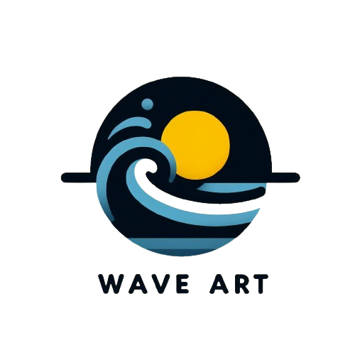

# Wave Art CSS

**Wave Art CSS** es un proyecto modular diseñado para facilitar la creación de interfaces de usuario modernas, altamente responsivas, accesibles y personalizables. Este proyecto implementa las últimas tendencias en CSS, incluyendo **CSS Grid**, **Flexbox**, **Consultas de Contenedores**, **Temas Oscuros y Claros**, y muchas más herramientas avanzadas.



## **Características**

1. **Diseño Modular**:

   - Estilos divididos en módulos para una fácil integración:
     - `base.css`: Estilos generales y normalización.
     - `theme.css`: Variables dinámicas de colores y tipografías.
     - `components.css`: Estilos de controles y elementos reutilizables.
     - `animations.css`: Animaciones avanzadas con `@keyframes` y scroll-driven animations.
     - `utilities.css`: Clases utilitarias para espaciados, alineaciones y helpers de Grid/Flexbox.

2. **Soporte para Temas Oscuros y Claros**:

   - Variables definidas en `theme.css` para manejar colores de manera dinámica.
   - Detecta automáticamente las preferencias del sistema (`prefers-color-scheme`).

3. **Totalmente Responsivo**:

   - Basado en CSS Logical Units (`clamp`, `min`, `max`).
   - Soporte para múltiples tamaños de pantalla y orientaciones.

4. **Animaciones Avanzadas**:

   - Animaciones definidas en `animations.css` con `@keyframes`.
   - Soporte para animaciones basadas en scroll (`scroll-driven animations`).

5. **Accesibilidad Nativa**:

   - Enfoque en estándares accesibles.
   - Compatible con lectores de pantalla y estándares ARIA.

6. **Integración con CSS Houdini**:
   - Preparado para personalizaciones avanzadas como `paint()` worklets.

---

## **Estructura del Proyecto**

```plaintext
├── 📂 assets/               # Recursos estáticos
│   ├── 📂 images/           # Imágenes generales del proyecto
│   ├── 📂 icons/            # Íconos SVG, PNG, etc.
│   └── 📂 favicons/         # Favicons en diferentes tamaños
├── 📂 docs/
│   ├── 📰 setup.md
│   ├── 📰 theming.md
│   └── 📰 usage.md   
├── 📂 src/
│   ├── 📝 base.css          # Estilos base
│   ├── 📝 theme.css         # Variables de temas
│   ├── 📝 components.css    # Estilos de controles
│   ├── 📝 animations.css    # Animaciones avanzadas
│   └── 📝 utilities.css     # Clases utilitarias para spacing, helpers, etc.
├── 📂 examples/
│   ├── 📄 base.html         # Ejemplo de estilos base
│   ├── 📄 components.html   # Ejemplo de controles estilizados
│   ├── 📄 animations.html   # Ejemplo de animaciones avanzadas
│   ├── 📄 form-example.html # Ejemplo de un formulario
│   ├── 📄 utilities.html    # Ejemplo de utilidades
│   └── 📄 theme.html        # Ejemplo de temas
└── 📰 README.md             # Documentación
```

---

## **Archivos CSS**

### **1. `base.css`**

Define los estilos globales:

- Normalización de estilos.
- Configuración de fuentes y tamaños base.
- Espaciados globales (`margin`, `padding`).

### **2. `theme.css`**

Variables de colores y tipografías adaptadas a temas:

- Colores dinámicos para modo claro y oscuro.
- Paletas de colores personalizables para diferentes marcas.
- Tipografías escalables.

### **3. `components.css`**

Estilos para controles comunes:

- Inputs (`text`, `email`, `password`, etc.).
- Botones, checkboxes, radios, selectores.
- Tablas, encabezados (`header`), contenido principal (`main`), y pies de página (`footer`).

### **4. `animations.css`**

Animaciones modernas:

- Transiciones suaves (`hover`, `focus`).
- Scroll-driven animations.
- Efectos avanzados con `@keyframes`.

### **5. `utilities.css`**

Clases utilitarias para:

- Espaciados (`.m-1`, `.p-2`, etc.).
- Helpers de Flexbox (`.flex-center`, `.flex-between`, etc.).
- Helpers de Grid (`.grid-2`, `.grid-3`, etc.).

---

## **Ejemplos**

### **1. Base**

Ejemplo que muestra los estilos globales como tipografía, márgenes, y colores.

### **2. Controles**

Formulario completo con todos los tipos de controles de entrada:

- Texto, números, email, rango, fechas, etc.
- Comprobación de comportamiento en modo claro/oscuro.

### **3. Animaciones**

Ejemplo interactivo de animaciones avanzadas:

- Scroll-driven animations.
- Transiciones de hover y focus.

### **4. Utilidades**

Ejemplo que muestra la aplicabilidad de las clases utilitarias:

- Layouts responsivos con Flexbox y Grid.
- Helpers de espaciado y alineación.

---

## **Uso**

1. **Instalación**:
   Clona el repositorio en tu máquina local:

   ```bash
   git clone https://github.com/tu-usuario/reactive-styles.git
   cd reactive-styles
   ```

2. **Configuración**:
   Incluye los archivos CSS en tu proyecto:

   ```html
   <link rel="stylesheet" href="src/theme.css" />
   <link rel="stylesheet" href="src/base.css" />
   <link rel="stylesheet" href="src/components.css" />
   <link rel="stylesheet" href="src/animations.css" />
   <link rel="stylesheet" href="src/utilities.css" />
   ```

3. **Prueba los ejemplos**:
   Abre los archivos HTML en la carpeta `examples/` para ver los estilos en acción.

---

## **Roadmap**

1. **Integrar CSS Houdini**:

   - Soporte para worklets personalizados.
   - Pinceles y efectos avanzados.

2. **Documentación Avanzada**:

   - Tutoriales interactivos.
   - Más ejemplos para diseños específicos.

3. **Soporte SCSS**:

   - Versiones adaptadas para preprocesadores.

4. **Biblioteca de Componentes**:
   - Estilos predefinidos para cards, modales, tooltips.

---

## **Contribuciones**

¡Todas las contribuciones son bienvenidas! Sigue estos pasos para contribuir:

1. Haz un fork del repositorio.
2. Crea una nueva rama para tu funcionalidad:

   ```bash
   git checkout -b feature/nueva-funcionalidad
   ```

3. Envía un pull request detallando los cambios realizados.

---

## **Licencia**

Este proyecto está bajo la Licencia MIT. Consulta el archivo `LICENSE` para más detalles.
